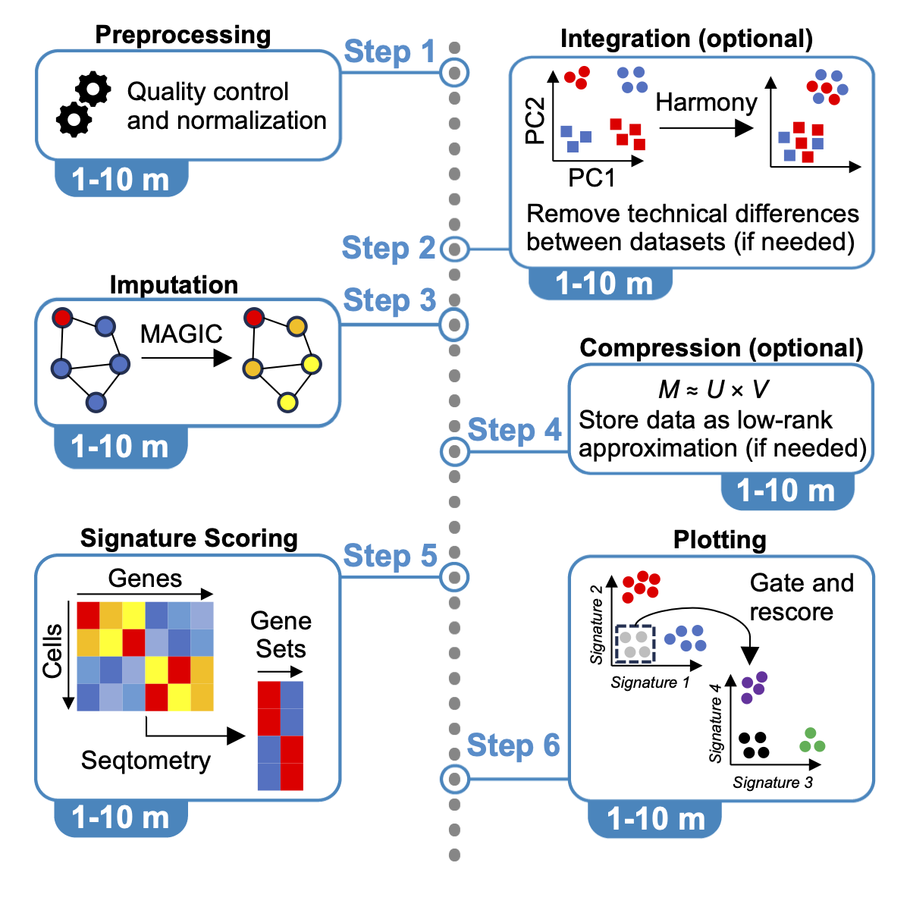
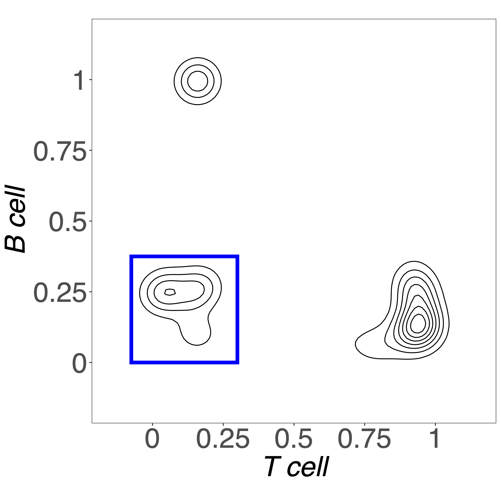
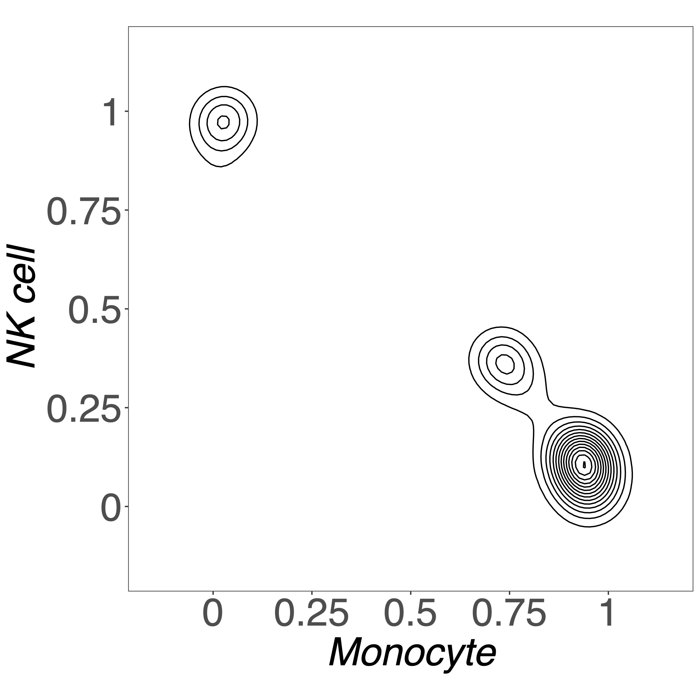

# Seqtometry
This is an R package for Seqtometry analysis of single cell data by scoring with signatures (gene sets). For additional details regarding the algorithmic details and applications of this method, please see the original Seqtometry publication:

Kousnetsov et al., Single-cell sequencing analysis within biologically relevant dimensions, Cell Systems (2023), https://doi.org/10.1016/j.cels.2023.12.005

> [!NOTE]
> For the accompanying GUI prototype, please see the [SeqtometryGUI repository](https://github.com/HawigerLab/SeqtometryGUI).

# Graphical abstract



# Quickstart

The following steps describe the basic Seqtometry workflow. For a more detailed protocol as well as step-by-step instructions for more advanced workflows, please see the following publication:

Kousnetsov and Hawiger, Analysis of single cell sequencing data by Seqtometry, STAR Protocols (2024).

## 1. Installation

Install the following:

a. The R programming language and a compatible integrated development environment (such as RStudio) or extensible text editor (such as VSCode).

> [!NOTE]
> Refer to the installation instructions specific to your operating system (Windows, macOS, or Linux) and CPU architecture. It may be convenient to install R using a package manager. 

> [!WARNING]
> The latest version of R (≥ 4.3.0) is required, given its support for new language features (the native pipe operator and its extensions). If you are using Windows, you will also need to install RTools.

b. Within R, install the following libraries, including Seqtometry and multiple additional packages required for the workflow.

```r
# For installing from Github and Bioconductor
install.packages(c("remotes", "BiocManager"))

# General purpose utilities for R
install.packages("tidyverse")

# Utilities for scRNA-seq analysis
install.packages("Seurat")
BiocManager::install("scuttle")

# For signature scoring (and imputation)
remotes::install_github("HawigerLab/Seqtometry")
```

## 2. Retrieve data and signatures

Download a small PBMC dataset and associated signatures.

```r
# Folder that will contain all downloaded data
DATA_DIR <- getwd() |> file.path("Data")
dir.create(DATA_DIR)

# Folder that will contain all generated plots
PLOT_DIR <- getwd() |> file.path("Plots")
dir.create(PLOT_DIR)

# 10 minutes max for a download before timeout error
options(timeout = 60 * 10)

# Download a file into the Data folder
fetch <- function(filename, url) {
  dest_file <- file.path(DATA_DIR, filename)
  download.file(url, dest_file, "curl")
}

# Extract (and then remove) a zipped tarball into the Data folder
extract <- function(filename) {
  tarfile <- file.path(DATA_DIR, filename)
  out_dir <- stringr::str_remove(tarfile, ".tgz$")
  untar(tarfile, exdir = out_dir)
  file.remove(tarfile)
}

# Download and unpack a small PBMC dataset from 10X Genomics
fetch("pbmc3k.tgz", "https://cf.10xgenomics.com/samples/cell-exp/1.1.0/pbmc3k/pbmc3k_filtered_gene_bc_matrices.tar.gz")
extract("pbmc3k.tgz")

# Retrieve signatures from the Seqtometry publication (supplementary Excel file)
fetch("signatures.xlsx", "https://ars.els-cdn.com/content/image/1-s2.0-S2405471223003599-mmc2.xlsx")
```

## 3. Import and preprocess data

a. Import: read in the gene expression data and extract the PBMC signatures.

```r
# Gene expression matrix
gex <- file.path(DATA_DIR, "pbmc3k", "filtered_gene_bc_matrices", "hg19") |>
  Seurat::Read10X()

# Signatures
sig_names <- c("T cell", "B cell", "NK cell", "Monocyte")
sig <- file.path(DATA_DIR, "signatures.xlsx") |>
  readxl::read_xlsx() |>
  dplyr::filter(`Signature name` %in% sig_names) |>
  dplyr::mutate(Genes = stringr::str_split(Genes, ", ")) |>
  dplyr::pull(Genes, name = `Signature name`)
```

b. Preprocessing: perform quality control, normalization, and imputation.

```r
qc <- function(mat) {
  # Indices of mitochondrial genes
  mito_idx <- grep("^MT-", rownames(mat))

  # Calculate QC metrics
  res <- mat |>
    scuttle::perCellQCMetrics(subsets = list("Mito" = mito_idx)) |>
    scuttle::perCellQCFilters(sub.fields = "subsets_Mito_percent")

  # Remove low quality cells
  mat <- mat[, !res$discard]

  # Remove unexpressed genes
  mat <- mat[Matrix::rowSums(mat) > 0, ]

  mat
}

# Quality control via removal of outliers
gex <- qc(gex)

# Normalize via LogCP10K transform 
gex <- Seurat::LogNormalize(gex)

# MAGIC imputation
imputed_gex <- Seqtometry::impute(gex, scale = FALSE)
```

## 4. Score and plot data

a. Score the data for the *T cell* and *B cell* signatures.

```r
scores <- sig[c("T cell", "B cell")] |>
  Seqtometry::score(imputed_gex, signatures = _)
```

b. Create a plot from the signature scores.

```r
# Avoid having to prefix common plot elements with ggplot2::
library(ggplot2)

# A flow cytometry style theme for plots
theme_custom <- theme_bw() + theme(
  aspect.ratio = 1,
  panel.grid = element_blank(),
  axis.title = element_text(size = 32),
  axis.text = element_text(size = 32),
  legend.text = element_text(size = 32),
  legend.title = element_text(size = 32))

# Utility function for generating flow cytometry style plots
biaxial_plot <- function(d, x, y, ...) {
  lim <- c(-0.15, 1.15)
  brk <- seq(0, 1, 0.25)
  lbl <- c("0", "0.25", "0.5", "0.75", "1")
  ggplot(d, aes(x = .data[[x]], y = .data[[y]])) +
    geom_density_2d(...) +
    scale_x_continuous(limits = lim, breaks = brk, labels = lbl) +
    scale_y_continuous(limits = lim, breaks = brk, labels = lbl) +
    theme_custom + theme(axis.title = element_text(face = "italic"))
}

# Utility function to draw a rectangular region
rect_region <- function(lims) {
  f <- purrr::partial(annotate, geom = "rect",
    color = "blue", fill = NA, linewidth = 2)
  do.call(f, lims)
}

# Limits defining a rectangular region for double negative cells
dn_lims <- list(xmin = -0.075, xmax = 0.3, ymin = 0, ymax = 0.375)

# Draw the biaxial plot with the rectangular region
biaxial_plot(scores, "T cell", "B cell", color = "black", h = c(0.2, 0.2)) +
  rect_region(dn_lims)

# Save the above plot
file.path(PLOT_DIR, "Basic_Workflow_B_and_T_Cell_Plot.pdf") |>
  ggsave(width = 8, height = 8)
```



c. Extract (gate) the cells negative for both signatures.

```r
# Subset the imputed data, keeping only the cells in the blue region
gated_imputed_gex <- with(scores,
  imputed_gex[, `T cell` < dn_lims$xmax & `B cell` < dn_lims$ymax])
```

d. Score the gated cells with the *Monocyte* and *NK cell* signatures.

```r
gated_scores <- sig[c("NK cell", "Monocyte")] |>
  Seqtometry::score(gated_imputed_gex, signatures = _)
```

e. Plot the scores for the gated cells.

```r
biaxial_plot(gated_scores, "Monocyte", "NK cell",
  color = "black", h = c(0.2, 0.2), binwidth = 2)

file.path(PLOT_DIR, "Basic_Workflow_NK_and_Monocyte_Plot.pdf") |>
  ggsave(width = 8, height = 8)
```



The above steps demonstrate how plots constructed from signature scores (using the Seqtometry scoring algorithm) can be used to identify the major PBMC populations in a hierarchical fashion (in a manner akin to flow cytometry). 

> [!NOTE] 
> Additional characterization of cells can be accomplished by employing signatures corresponding to biological processes of interest. Please see the [original Seqtometry publication](#seqtometry) for examples.